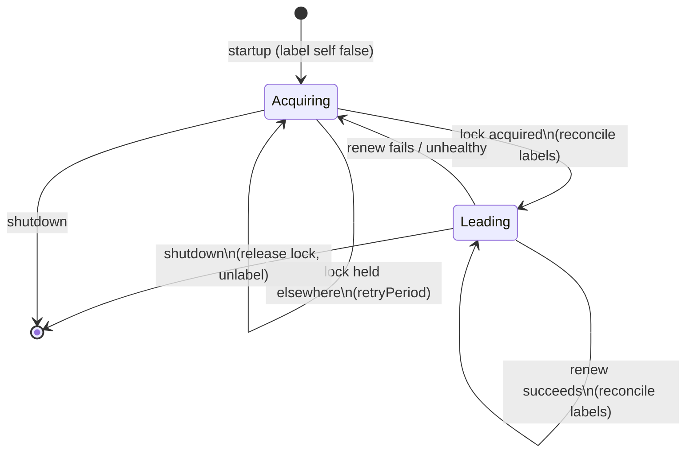

<div align="center">

# k8s-leader-elector

*A tiny Redis-backed leader election sidecar for Kubernetes*

[](https://github.com/jabrown93/k8s-leader-elector/actions/workflows/ci.yml)
[](https://github.com/jabrown93/k8s-leader-elector/actions/workflows/codeql.yml)
[](pom.xml)
[](https://github.com/jabrown93/k8s-leader-elector/tags)
[](LICENSE)

[Features](#features) • [How it works](#how-it-works) • [Getting started](#getting-started) • [Deploying](#deploying-as-a-sidecar) • [Configuration](#configuration)

</div>

> [!WARNING]
> Under active development — bugs are likely, and fixes may take a while.

**k8s-leader-elector** is a small Spring Boot sidecar that gives a StatefulSet or Deployment a single,
self-healing leader without touching application code. It acquires a distributed lock in Redis and
reflects the result as a Kubernetes Pod label, so anything downstream — a `Service` selector, a
`kubectl` query, another controller — can find "the leader" with a plain label lookup instead of
embedding its own election logic.

## Features

- **Redis-backed election** — leadership is a distributed lock (`RedisLockRegistry` via Spring
  Integration), renewed on a configurable interval and released cleanly on shutdown.
- **Self-healing labels** — the leader label is reconciled on every renewal, not just on
  acquisition, so a pod created or missed after the last election catches up within one renewal
  interval instead of staying wrong until the next leadership change.
- **Optional health gating** — wire in your own liveness signal and an unhealthy pod won't acquire
  or keep leadership, with a deadlock escape hatch so the system doesn't stay leaderless forever
  even when every pod is unhealthy.
- **Graceful shutdown** — the lock is released and the leader label cleared before the pod
  terminates, within `terminationGracePeriodSeconds`.
- **Tool-free image** — no kubectl baked in; just a JVM and `tini` for signal handling. (The Alpine
  base still carries `/bin/sh`, so this isn't a distroless-level minimal image.)

## How it works

Each replica runs the sidecar and races the others for a single Redis lock. The winner labels
itself (default `dns.jb.io/leader=true`) and labels every other matching pod `=false`; losing that
lock — or going unhealthy, if health gating is enabled — hands leadership to the next pod that
acquires it.



Renewal, acquisition, and release all run on a single dedicated thread, since the underlying Redis
lock is thread-owned — this keeps the state machine above simple and race-free by construction
rather than by locking.

> [!TIP]
> Health gating is opt-in and off by default. Point it at any file your application already
> maintains (health status on a shared `emptyDir`, for example) — the elector only reads it, so no
> extra tooling or protocol is required. See [Health-gated leadership](#health-gated-leadership).

## Getting started

### Prerequisites

- Java 25 (Amazon Corretto in the shipped image) and Maven 3.9+
- A reachable Redis instance
- Kubernetes API access (in-cluster service account, or a local kubeconfig) with permission to
  `get`/`list`/`patch` pods

### Build

```bash
mvn clean install
```

### Run locally

The elector needs `POD_NAME` and enough config to know which lock and labels to use. `POD_NAME`
must match the name of a real Pod in your current kube context that carries the selector label
below — the elector patches that Pod by name, so a name with no matching Pod will still acquire
the Redis lock but log a failed self-patch on every reconcile.

```bash
# Create a placeholder Pod for the elector to label (skip if you already have one):
kubectl run local-test --image=registry.k8s.io/pause:3.9 --labels=app=my-app

export POD_NAME=local-test
export ELECTOR_LABEL_KEY=dns.jb.io/leader
export ELECTOR_LOCK_NAME=my-app-lock
export ELECTOR_SELECTOR_LABEL_KEY=app
export ELECTOR_SELECTOR_LABEL_VALUE=my-app
export SPRING_DATA_REDIS_HOST=localhost

mvn spring-boot:run
```

It will start electing immediately against whatever Kubernetes context and Redis host it finds, so
point those at a scratch namespace/instance if you're just trying it out.

### Docker

```bash
# Local test build (current platform only)
docker build -t k8s-leader-elector:test .

# Multi-platform build via Makefile (linux/amd64, linux/arm64), no push
make docker-build

# Build and push to the configured registry
make docker-release
```

## Deploying as a sidecar

The elector needs a `Role` scoped to the pods it labels, bound to the workload's service account:

```yaml
apiVersion: rbac.authorization.k8s.io/v1
kind: Role
metadata:
  name: leader-elector
rules:
  - apiGroups: [""]
    resources: ["pods"]
    verbs: ["get", "list", "patch"]
---
apiVersion: rbac.authorization.k8s.io/v1
kind: RoleBinding
metadata:
  name: leader-elector
subjects:
  - kind: ServiceAccount
    name: my-app
    namespace: my-namespace # required: ServiceAccount subjects don't default to the RoleBinding's namespace
roleRef:
  kind: Role
  name: leader-elector
  apiGroup: rbac.authorization.k8s.io
```

Then add it as a second container alongside your application:

```yaml
spec:
  serviceAccountName: my-app
  containers:
    - name: my-app
      image: my-app:latest
      # ...

    - name: leader-elector
      image: ghcr.io/jabrown93/k8s-leader-elector:latest
      env:
        - name: POD_NAME
          valueFrom:
            fieldRef:
              fieldPath: metadata.name
        - name: ELECTOR_LABEL_KEY
          value: dns.jb.io/leader
        - name: ELECTOR_LOCK_NAME
          value: my-app-lock
        - name: ELECTOR_SELECTOR_LABEL_KEY
          value: app
        - name: ELECTOR_SELECTOR_LABEL_VALUE
          value: my-app
        - name: SPRING_DATA_REDIS_HOST
          value: redis.default.svc.cluster.local
      resources:
        requests:
          cpu: 25m
          memory: 128Mi
        limits:
          memory: 256Mi
```

Downstream consumers then just select on the label, e.g. `kubectl get pods -l dns.jb.io/leader=true`,
or point a `Service` at it to route to whichever pod(s) currently carry the leader label. Label
reconciliation is sequential and tolerates per-pod patch failures until the next renewal, so during
acquisition or failover the Service can briefly expose zero or more than one endpoint — it's not an
exactly-once routing guarantee.

## Configuration

All properties bind via Spring relaxed rules, so `elector.labelKey` can be set as
`ELECTOR_LABEL_KEY`.

| Variable | Default | Description |
|----------|---------|-------------|
| `ELECTOR_LABEL_KEY` | — | Label set to `true`/`false` to mark the leader |
| `ELECTOR_LOCK_NAME` | — | Redis lock name |
| `ELECTOR_SELECTOR_LABEL_KEY` / `ELECTOR_SELECTOR_LABEL_VALUE` | — | Selects the pods to label |
| `ELECTOR_LEASE_DURATION` | `120s` | Lock TTL in Redis |
| `ELECTOR_RENEW_DEADLINE` | `60s` | How often the lock (and leader labels) are renewed |
| `ELECTOR_RETRY_PERIOD` | `5s` | Acquire retry interval when not holding the lock |
| `SPRING_DATA_REDIS_HOST` | `localhost` | Redis host backing the lock |
| `POD_NAME` | — | This pod's name, injected via the downward API |

### Health-gated leadership

Disabled by default; when enabled, a pod must be healthy to acquire — or keep — leadership. The
elector stays generic and tool-free: your application writes its own notion of "fit to lead" to a
status file, and the elector only reads it.

| Variable | Default | Description |
|----------|---------|-------------|
| `ELECTOR_HEALTH_PROBE_ENABLED` | `false` | Master switch; off behaves exactly as without health gating |
| `ELECTOR_HEALTH_PROBE_FILE_PATH` | — | Status file to read |
| `ELECTOR_HEALTH_PROBE_HEALTHY_CONTENT` | `healthy` | Trimmed file content that means healthy |
| `ELECTOR_HEALTH_PROBE_MAX_AGE` | `2m` | Reject the file if not updated within this window (`0` disables) |
| `ELECTOR_HEALTH_PROBE_FAILURE_THRESHOLD` | `3` | Consecutive failures tolerated while leading, before relinquishing |
| `ELECTOR_HEALTH_PROBE_DEADLOCK_GRACE` | `5m` | How long to wait before leading in a degraded state when no pod is healthy |
| `ELECTOR_HEALTH_PROBE_UNHEALTHY_BACKOFF` | `30s` | Re-probe interval for an unhealthy pod, so it doesn't starve healthy peers racing to take over |

> [!NOTE]
> The deadlock grace and unhealthy backoff exist to avoid two failure modes with no healthy
> candidate available: leaving the deployment leaderless forever, and an unhealthy ex-leader
> re-acquiring and releasing the free lock fast enough to starve peers that are trying to take over.

## Container image

Released images (`ghcr.io/jabrown93/k8s-leader-elector`) are built for `linux/amd64` and
`linux/arm64`, run under `tini` for proper signal handling and zombie reaping, and ship with:

- JVM heap sized dynamically from the container's memory limit (`-XX:+UseContainerSupport`,
  50–75% of the allocation)
- Clean exit and a heap dump at `/tmp/heapdump.hprof` on OOM, instead of hanging
- A CycloneDX SBOM and max-mode build provenance attached as OCI referrers
- A keyless cosign signature over the pushed digest, so image-verification policies (e.g. Kyverno)
  can validate it
